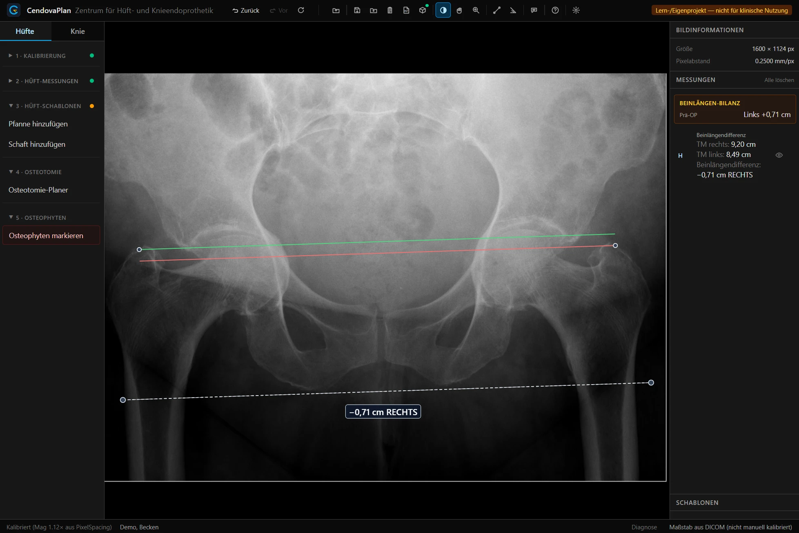
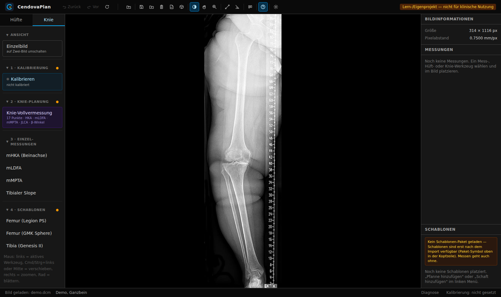

# CendovaPlan

[](https://github.com/cendova/cendova-plan/actions/workflows/verify.yml)
[](https://cendova.de/cendova-plan/)

Browser-basiertes Planungstool für **Hüft- und Knie-Endoprothetik** (DICOM) —
Teil der **Cendova**-Suite (geplant: CendovaView · CendovaCare).
Website: <https://cendova.de/>

> ⚠️ **Kein Medizinprodukt.** Lern-/Forschungsprojekt, nicht CE-zertifiziert,
> **nicht für die klinische Anwendung** bestimmt. Details: [DISCLAIMER.md](DISCLAIMER.md).

**Live-Demo:** <https://cendova.de/cendova-plan/> — läuft vollständig
im Browser, DICOM-Dateien verlassen den Rechner nicht. Die Demo enthält
keine Hersteller-Schablonen ([warum?](docs/schablonen-pakete.md));
Messungen, Pläne und PDF-Export sind uneingeschränkt nutzbar.

| Hüfte — Beinlängen-Bilanz (Beckenübersicht AP) | Knie — 17-Punkt-Vollvermessung + CPAK (Ganzbein) |
| --- | --- |
|  |  |

<sub>Screenshots mit frei lizenzierten Lehr-Röntgenbildern (keine Patienten-
oder Herstellerdaten) — Quellen & Lizenzen: [docs/screenshots/QUELLEN.md](docs/screenshots/QUELLEN.md).</sub>

## Funktionen

- DICOM-Röntgen laden, anzeigen, kalibrieren — rein lokal im Browser
- **Hüfte:** Messungen (LLD, globales Offset, CE-/CCD-Winkel), Pfannen-/
  Schaft-Templating, Osteotomie-Planer, LLD-Bilanz prä/post
- **Knie:** 17-Punkt-Vollvermessung (mHKA, mLDFA, mMPTA, JLCA),
  CPAK-Klassifikation, Implantat-Positionierung mit Live-CPAK,
  Zwei-Bild-Ansicht AP + seitlich
- Plan speichern/laden (JSON mit eingebettetem Bild), PDF-Export

## Datenschutz

Patientenbezogene Bilddaten werden **ausschließlich lokal** im Browser
verarbeitet — kein Server, keine Übertragung. Siehe [DISCLAIMER.md](DISCLAIMER.md).

## Installation (eigener Rechner / Klinik-PC)

Ein-Klick-Installer — richtet Git und Node.js selbst ein und legt eine
Desktop-Verknüpfung an, die beim Start automatisch aktualisiert:

- **Windows:** [CendovaPlan-Installer-Windows.zip](https://github.com/cendova/cendova-plan/releases/latest/download/CendovaPlan-Installer-Windows.zip)
  — entpacken, „Installieren.cmd" doppelklicken
- **macOS:** [CendovaPlan-Installer-macOS.zip](https://github.com/cendova/cendova-plan/releases/latest/download/CendovaPlan-Installer-macOS.zip)
  — entpacken, Rechtsklick auf „install-mac.command" → „Öffnen"

Details und Hinweise für die Klinik-IT:
[docs/klinik-installation.md](docs/klinik-installation.md)

## Entwicklung

Voraussetzung: Node.js ≥ 20.

```bash
npm install
npm run dev       # Dev-Server + Browser: http://localhost:5173
npm run verify    # Typecheck + Build (Abnahmekriterium)
```

Testen: [docs/test-runbook.md](docs/test-runbook.md) ·
Klinik-Installation: [docs/klinik-installation.md](docs/klinik-installation.md)

## Stack

React 19 · TypeScript · Vite 6 · Tailwind CSS 4 · Cornerstone3D (WebGL) —
reines Frontend, kein Backend.

## Mitwirken

Hinweise zu Setup, Tests und den harten Regeln (keine Hersteller-/
Patientendaten): [CONTRIBUTING.md](CONTRIBUTING.md) ·
Sicherheitsmeldungen: [SECURITY.md](SECURITY.md)

## Lizenz

[Apache-2.0](LICENSE) · Copyright 2026 Philipp A. Michel — siehe [NOTICE](NOTICE)
und [DISCLAIMER.md](DISCLAIMER.md).
